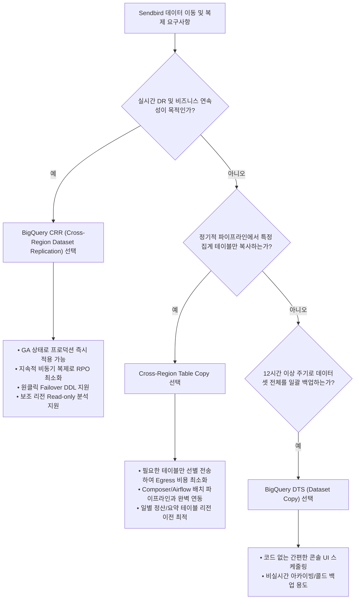

# BigQuery 크로스 리전 데이터 이전 및 복제 솔루션 비교 분석 보고서
**고객사:** Sendbird (센드버드)  
**작성일:** 2026년 9월  
**작성자:** Google Cloud Customer Engineering / Solutions Architecture  

---

## 1. Executive Summary (경영진 요약)

Sendbird와 같이 글로벌 사용자 기반의 대규모 실시간 메시징, 음성/영상 통화, AI 챗봇 서비스를 운영하는 엔터프라이즈 환경에서는 **글로벌 데이터 일관성, 재해 복구(DR) 역량, 지연 시간 최소화, 그리고 네트워크 및 스토리지 비용 최적화**가 핵심 아키텍처 요구사항입니다.

본 보고서는 Google Cloud BigQuery에서 제공하는 3가지 주요 크로스 리전(Cross-Region) 데이터 이동 및 동기화 솔루션인 **1) BigQuery Data Transfer Service (DTS) Dataset Copy**, **2) Cross-Region Table Copy**, **3) Cross-Region Dataset Replication (CRR)**을 기술적/비즈니스 관점에서 심층 비교 분석하고, Sendbird의 워크로드 특성에 맞는 최적의 아키텍처 가이드와 테스트 검증 환경을 제시합니다.

### 핵심 결론 요약:
1. **재해 복구(DR) 및 상시 비즈니스 연속성(BCP)**:  
   👉 **BigQuery CRR (Cross-Region Dataset Replication)**이 유일한 **GA(Generally Available)** 솔루션이며, BigQuery 엔진 레벨에서 비동기 지속 복제(Continuous Asynchronous Replication)를 제공하여 RPO를 수 초~수 분(Turbo 적용 시 15분 보장)으로 최소화합니다.
2. **배치 기반 파이프라인 및 특정 테이블 선별 이전**:  
   👉 **Cross-Region Table Copy**는 현재 **Preview** 단계이나, 데이터셋 전체가 아닌 특정 일자/테이블만 선별하여 프로그래밍 방식(Airflow, Composer, Python SDK)으로 복사할 때 가장 유연합니다.
3. **주기적 데이터셋 전체 분석 동기화 (비실시간)**:  
   👉 **BigQuery DTS Dataset Copy**는 콘솔 UI 기반으로 구성이 용이하지만, **Beta(Pre-GA)** 상태이며 최소 동기화 주기가 12시간이고 매 복사 시 테이블 전체를 덮어쓰는(Truncate & Replace) 제약이 있어 준실시간 DR로는 부적합합니다.

---

## 2. 솔루션별 핵심 비교 매트릭스

| 비교 항목 | 1. BigQuery DTS (Dataset Copy) | 2. Cross-Region Table Copy | 3. BigQuery CRR (Dataset Replication) |
| :--- | :--- | :--- | :--- |
| **현재 출시 상태** | **Beta (Pre-GA)** | **Preview (Pre-GA)** | **GA (Generally Available)** *(Turbo DR: Ent+ GA)* |
| **복제/동기화 단위** | 데이터셋 (Dataset) 전체 | 테이블 (Table, Snapshot, Clone) 단위 | 데이터셋 (Dataset) 전체 |
| **동기화 주기 / RPO** | 스케줄 기반 (최소 12시간 주기) | 온디맨드 / 배치 실행 시점 기준 | **지속적 비동기 복제 (실시간~수 분 단위)** |
| **적합한 Usecase** | • 비실시간 일별 데이터셋 백업<br>• 12시간 이상 주기의 분석용 데이터 동기화<br>• 단발성 전체 데이터셋 리전 마이그레이션 | • 파이프라인 연계 특정 테이블 선별 복사<br>• 일별 파티션/정산 테이블 타 리전 전송<br>• 일회성 테이블/스냅샷 이전 | • **엔터프라이즈 재해 복구(DR/BCP)**<br>• 멀티 리전 현지 읽기 복제본(Read Replica)<br>• 글로벌 대시보드/BI 리전 분산 |
| **비용 구조 (Cost)** | • 오케스트레이션: 무료<br>• 네트워크 전송: 일반 Egress 요금 적용<br>• 대상 스토리지: 표준 BQ 스토리지 요금 | • Copy Job Compute: 무료 (슬롯 미소모)<br>• 네트워크 전송: Data Replication Egress 요율<br>• 대상 스토리지: 표준 BQ 스토리지 요금 | • **복제 네트워크 전송: $0.02~$0.08 / GiB** (압축 기준)<br>• 대상 스토리지: 표준 BQ 스토리지 요금 (Active/Long-term 유지)<br>• 보조 리전 쿼리: 현지 슬롯 또는 On-demand |
| **동일 대륙 간 전송 비용** | 약 $0.01 ~ $0.02 / GB | $0.02 / GiB (북미/유럽 내) | **$0.02 / GiB** (US/EU 내), **$0.08 / GiB** (Asia 내) |
| **대륙 간 전송 비용** | 약 $0.08 ~ $0.12 / GB | $0.05~$0.08 / GiB | **$0.05 / GiB** (US-EU), **$0.08 / GiB** (US-Asia) |
| **복사 방식 및 증분 지원** | • 변경 테이블: **전체 덮어쓰기(Truncate)**<br>• 미변경 테이블: Skip<br>• Append 미지원 | • 전체 덮어쓰기(`WriteTruncate`) 또는 생성<br>• 파티션 단위 개별 복사 불가 | • **스토리지 엔진 차원의 증분(Incremental) 지속 복제**<br>• 물리 압축 바이트만 전송 |
| **Failover / 전환 방식** | 수동 (애플리케이션 타겟 데이터셋 변경) | 수동 (애플리케이션 참조 테이블 변경) | **DDL 1줄로 즉각 승격 (`ALTER SCHEMA SET OPTIONS`)** |
| **보조 리전 읽기 지원** | 복사 완료된 테이블 일반 읽기/쓰기 가능 | 복사 완료된 테이블 일반 읽기/쓰기 가능 | **보조 복제본에서 실시간 Read-Only 쿼리 지원** |
| **핵심 제약사항** | • 최소 주기 12시간<br>• Views, UDF, External Table 미지원<br>• Cross-region CDC 미지원<br>• 테이블 변경 시 전체 재전송 비용 발생 | • Preview 단계 (SLA 미지원)<br>• 작업 시작 후 취소 불가 (중도 취소 시에도 비용 발생)<br>• 컬럼 레벨 보안(Policy Tags) 복사 불가 | • 보조 복제본은 Read-Only (직접 쓰기 불가)<br>• Streaming Write API/CDC는 지연 발생 가능(Best-effort)<br>• 데이터셋당 리전별 1개 복제본 제한 |

---

## 3. 솔루션별 심층 분석

### 3.1 BigQuery Data Transfer Service (DTS) - Dataset Copy

#### (1) 동작 방식 및 적합한 Usecase
BigQuery DTS Dataset Copy는 Google Cloud의 관리형 전송 백엔드를 활용하여 원본 데이터셋의 테이블들을 대상 리전의 데이터셋으로 일괄 복제하는 기능입니다.
* **적합한 Usecase:**
  * 하루 1회 또는 12시간 단위로 전체 데이터셋을 타 리전(예: US → Seoul)에 백업해두어야 하는 경우
  * 원본 데이터셋에 수십~수백 개의 테이블이 있어, 별도의 ETL 파이프라인 개발 없이 콘솔에서 손쉽게 일괄 복제를 설정하고 싶을 때
  * 프로젝트 이전 또는 데이터센터 마이그레이션을 위해 1회성(One-time)으로 전체 데이터셋을 이전할 때

#### (2) 출시 상태 (Launch Stage)
* **Beta (Pre-GA / Preview)** 상태입니다.
* Google Cloud 서비스 약관의 "Pre-GA Offerings Terms"가 적용되며, 공식 SLA가 제공되지 않습니다.

#### (3) 비용 (Pricing)
* **오케스트레이션 비용:** 무료 (BigQuery DTS 서비스 자체 수수료 없음).
* **데이터 전송 비용 (Network Egress):** Google Cloud Inter-region Network Egress 요금이 청구됩니다. (단, BigQuery 내부 전송 시 압축된 형태로 전송되어 실제 논리 데이터 크기보다 청구 데이터량이 적음).
* **스토리지 비용:** 대상 리전의 BigQuery 스토리지 요율에 따라 원본과 동일한 용량의 스토리지 비용이 부과됩니다.

#### (4) 장점
* **손쉬운 설정:** Cloud Console UI에서 데이터셋 선택 후 "Copy" 클릭만으로 구성 가능.
* **자동 스케줄링 및 모니터링:** 기본 내장된 스케줄러로 반복 실행 가능하며, Email 및 Pub/Sub 알림 연동 지원.
* **미변경 테이블 자동 스킵:** 마지막 복사 이후 변경되지 않은 테이블은 자동으로 전송을 건너뛰어 불필요한 네트워크 비용 방지.
* **파티션/클러스터링 유지:** 원본 테이블의 파티셔닝 및 클러스터링 메타데이터가 그대로 대상 테이블에 유지됨.

#### (5) 단점 및 한계점
* **최소 12시간 주기:** 12시간보다 짧은 주기로 스케줄을 설정할 수 없으므로, 준실시간(Near Real-Time) 동기화나 RPO가 짧은 DR 환경에는 부적합합니다.
* **전체 덮어쓰기(Truncate & Replace) 메커니즘:** 테이블에 단 1건의 row가 추가되었더라도, 대상 테이블 전체를 Drop/Truncate하고 다시 복사합니다. 대용량 테이블(수 TB 이상)의 경우 매 복사마다 막대한 네트워크 Egress 비용이 발생합니다.
* **지원하지 않는 리소스:** 뷰(Views), 사용자 정의 함수(UDF/Routines), 외부 테이블(External Tables), 크로스 리전 CDC 테이블은 복사되지 않습니다. 또한 크로스 리전 복사 시 **CMEK(고객 관리 암호화 키)로 암호화된 테이블도 지원되지 않습니다.**
* **동시 실행 제한:** 동일 데이터셋 복사 설정에 대해 한 번에 하나의 전송 실행만 활성화되며, 추가 실행은 큐에 대기합니다.

---

### 3.2 Cross-Region Table Copy (BQ Copy Job)

#### (1) 동작 방식 및 적합한 Usecase
BigQuery의 테이블 복사 작업(`bq cp`, API `jobs.insert`, 클라이언트 라이브러리 `copy_table`)을 서로 다른 리전 간에 수행하는 기능입니다.
* **적합한 Usecase:**
  * **파이프라인 연계 특정 테이블 복사:** 일별 배치 집계가 완료된 `daily_chat_summary` 테이블만 서울 리전에서 미국 리전으로 전송할 때
  * **데이터셋 전체가 아닌 대용량 핵심 테이블 선별 이전:** 비정형 로그는 제외하고 핵심 트랜잭션 테이블만 타 리전에 복제할 때
  * **Table Snapshot 및 Table Clone 복사:** 특정 시점 스냅샷을 다른 리전에 보관하거나 테스트 환경으로 복제할 때

#### (2) 출시 상태 (Launch Stage)
* **Preview (Pre-GA)** 상태입니다.
* BigQuery 공식 문서의 `managing-tables#copy_tables_across_regions`에 Preview 태그가 명시되어 있으며 Pre-GA 약관이 적용됩니다.

#### (3) 비용 (Pricing)
* **컴퓨트 비용:** 무료 (Copy Job은 BigQuery 슬롯을 소모하지 않는 관리형 백그라운드 작업임).
* **데이터 전송 비용 (Network Egress):** BigQuery Data Replication Egress 요율이 적용됩니다.
  * 북미 내 리전 간: $0.02 / GiB
  * 북미 ↔ 아시아 (예: Iowa ↔ Seoul): $0.08 / GiB
  * 아시아 내 리전 간 (예: Tokyo ↔ Seoul): $0.08 / GiB
  * **[주의]** Google Cloud 공식 문서에 따르면 테이블 복사 작업은 시작 후 **취소 자체가 불가능**하며(`"You can't stop a table copy operation after you start it... doesn't stop even when you cancel the job"`), 취소를 요청해도 작업은 백그라운드에서 끝까지 실행되어 전체 전송량에 대한 비용이 그대로 청구됩니다. ("취소 시점까지"만 과금된다는 표현은 부정확하므로 시연 시 유의)
* **스토리지 비용:** 대상 리전의 BigQuery 스토리지 요금이 부과됩니다.

#### (4) 장점
* **정밀한 제어(Fine-grained Control):** 데이터셋 전체를 옮길 필요 없이, 파이프라인에서 필요한 테이블만 선택적으로 전송하여 네트워크 비용을 획기적으로 절감할 수 있습니다.
* **자동화 및 오케스트레이션 친화적:** Python SDK, Airflow (Cloud Composer), Cloud Workflows, Cloud Functions 등과 완벽하게 통합됩니다.
* **테이블 덮어쓰기 지원:** `--force` (`write_disposition='WRITE_TRUNCATE'`) 옵션으로 대상 테이블을 손쉽게 갱신할 수 있습니다.
* **Table Snapshot/Clone 지원:** 다른 리전으로의 스냅샷 복제를 공식 지원합니다.

#### (5) 단점 및 한계점
* **Preview 단계:** 엔터프라이즈 핵심 SLA 대상이 아니므로 예기치 않은 동작이나 API 변경 가능성이 있습니다.
* **작업 중단 불가:** 테이블 복사 작업이 시작되면 백그라운드에서 비동기로 실행되며, 사용자가 cancel을 호출해도 내부 프로세스가 즉시 정지되지 않고 전송 비용이 청구됩니다.
* **보안 태그 복사 미지원:** 컬럼 레벨 보안(Policy Tags)은 복사되지 않으며, 행 레벨 보안(Row-level Security) 정책명이 대상 데이터셋과 충돌할 경우 작업이 실패합니다.
* **스케줄링 기능 부재:** DTS와 달리 자체 스케줄러가 없으므로 Cloud Scheduler나 Airflow 등 외부 오케스트레이터가 필수적입니다.

---

### 3.3 BigQuery CRR (Cross-Region Dataset Replication)

#### (1) 동작 방식 및 적합한 Usecase
BigQuery 스토리지 계층(Colossus)에서 원본(Primary) 데이터셋의 모든 쓰기(Write) 및 DDL 변경사항을 대상(Secondary) 리전으로 비동기 스트리밍 복제하는 엔터프라이즈급 기능입니다.
* **적합한 Usecase:**
  * **엔터프라이즈 비즈니스 연속성 및 재해 복구(DR):** 메인 리전 장애 발생 시 단일 DDL 명령(`ALTER SCHEMA SET OPTIONS(primary_replica=...)`)으로 즉시 보조 리전을 Primary로 승격하여 서비스 중단을 최소화.
  * **글로벌 읽기 분산(Geo-distributed Read Replica):** 예를 들어 미국 리전에서 생성되는 대규모 원본 데이터를 서울 리전에 복제해 두고, 국내 분석가/대시보드가 로컬 리전에서 지연 시간 없이 쿼리.
  * **무중단 리전 마이그레이션:** 서비스 중단 없이 원본 데이터를 다른 리전으로 동기화한 후 원클릭 승격 및 구 리전 복제본 삭제.

#### (2) 출시 상태 (Launch Stage)
* **GA (Generally Available)** 상태입니다.
* 엔터프라이즈 프로덕션 환경에 즉각 도입할 수 있는 정식 지원 기능입니다.
* *참고: 15분 RPO를 보장하는 'Turbo Replication' 및 컴퓨트(슬롯) 자동 장애 조치를 포함하는 'Managed Disaster Recovery'는 BigQuery Enterprise Plus Edition에서 GA로 제공됩니다.*

#### (3) 비용 (Pricing)
* **데이터 복제 네트워크 비용 (Data Replication Egress SKUs):**
  * 동일 위치 또는 연계 멀티리전(US Multi ↔ us-central1, EU Multi ↔ europe-west4): **무료(Free)**
  * 북미 대륙 내 리전 간 (예: us-central1 ↔ us-east4): **$0.02 / GiB**
  * 북미 ↔ 유럽: **$0.05 / GiB**
  * 북미 ↔ 아시아 (예: us-central1 ↔ asia-northeast3 서울): **$0.08 / GiB**
  * 아시아 내 리전 간 (예: asia-northeast1 도쿄 ↔ asia-northeast3 서울): **$0.08 / GiB**
  * *모든 요금은 압축된 물리 바이트(Physical bytes) 기준으로 청구되므로 논리 데이터 대비 전송 비용이 매우 효율적입니다.*
* **스토리지 비용:** 보조 리전에 복제된 데이터 크기만큼 대상 리전의 스토리지 요금이 청구됩니다. (단, 원본에서 Long-term 스토리지 할인 요건을 만족한 데이터는 보조 리전에서도 Long-term 상태가 그대로 유지됩니다).
* **컴퓨트 비용:** 복제 자체는 슬롯을 소모하지 않습니다. 단, 보조 리전의 복제본을 대상으로 읽기 쿼리를 실행하려면 해당 보조 리전에 슬롯 예약(Reservation) 또는 On-demand 쿼리 비용이 발생합니다.

#### (4) 장점
* **정식 GA 검증성:** Google Cloud의 강력한 엔터프라이즈 SLA가 적용됩니다.
* **완전 관리형 연속 복제:** 별도의 스케줄러, 파이프라인, 모니터링 코드를 작성할 필요 없이 BigQuery가 내부적으로 변경된 데이터 블록만 지속적으로 전송합니다.
* **최소의 RPO:** 수 초에서 수 분 이내로 데이터가 복제되어 데이터 유실을 극소화합니다.
* **원클릭 장애 조치(Failover):** DDL 한 줄로 Primary 전환이 완료되며, 애플리케이션의 쿼리 엔드포인트를 손쉽게 절체할 수 있습니다.
* **보조 리전 실시간 Read-Only 쿼리 지원:** 분석용 쿼리를 보조 리전으로 오프로딩하여 Primary 리전의 슬롯 부하를 분산할 수 있습니다.

#### (5) 단점 및 한계점
* **보조 복제본의 Read-Only 제약:** Primary로 승격하기 전까지는 보조 리전에서 직접 데이터를 INSERT/UPDATE/DELETE할 수 없습니다.
* **스트리밍 인제스천 복제 지연 (Best-effort):** Storage Write API (gRPC) 또는 Datastream을 통한 고속 스트리밍 데이터의 경우, 배치 적재 데이터에 비해 복제 지연(Replication lag)이 증가할 수 있습니다.
* **데이터셋 크기 및 테이블 한도:** 기본적으로 데이터셋당 100,000개 미만의 테이블, 비멀티리전의 경우 500TB 용량 제한이 적용됩니다 (필요 시 할당량 증설 요청 필요).
* **복제본 개수 제한:** 데이터셋당 특정 대상 리전에는 1개의 복제본만 생성할 수 있습니다.
* **일일 추가/삭제 횟수 제한:** 동일 데이터셋에 대해 동일 리전으로의 복제본 추가(후 삭제)는 하루 최대 4회로 제한됩니다. **(반복 테스트/데모 시 실제로 부딪힐 수 있는 제약이므로 주의)**
* **Fine-grained DML 테이블 미지원:** 행 단위 세분화 DML이 활성화된 테이블은 지원되지 않습니다.

---

## 4. Sendbird 워크로드 분석 및 권장 아키텍처

### 4.1 Sendbird의 데이터 특성
1. **고빈도 실시간 메시징 이벤트**: 수백만 사용자의 대화, 채널 이벤트, 접속 상태 등이 BigQuery Storage Write API를 통해 실시간으로 스트리밍 인제스천됩니다.
2. **글로벌 리전 분산**: 미국, 유럽, 아시아 각지의 사용자가 생성한 데이터가 수집되며, 글로벌 리포팅 및 현지 규제(Data Residency) 요구사항이 공존합니다.
3. **무중단 운영 요구(High Availability)**: 서비스 중단이나 데이터 유실 시 전 세계 채팅 서비스의 장애로 직결될 수 있으므로 견고한 DR 체계가 필수적입니다.

### 4.2 아키텍처 권장안 (Solution Decision Framework)



### 4.3 종합 권고 요약
* **재해 복구(DR) 및 엔터프라이즈 운영:** **BigQuery CRR**을 전사 표준으로 채택하십시오. 실시간 변경사항이 자동으로 반영되며, 장애 발생 시 `ALTER SCHEMA SET OPTIONS(primary_replica=...)`로 즉각적인 복구가 가능합니다.
* **비용 최적화 배치 분석:** 일별로 집계된 통계/정산 테이블을 다른 리전으로 공유할 때는 **Cross-Region Table Copy** 스크립트를 사용하여 데이터셋 전체가 아닌 해당 테이블만 복사함으로써 Egress 비용을 90% 이상 절감하십시오.
* **DTS 활용 범위:** 개발/테스트 환경의 일회성 데이터 마이그레이션이나, 긴 주기의 단순 백업에 한정하여 사용하는 것을 권장합니다.

---

## 5. 실습 및 고객 데모용 테스트 환경 구성

Sendbird 고객 엔지니어링 팀에게 직접 시연하고 PoC를 수행할 수 있도록, 워크스페이스 내에 재현 가능한 완전한 테스트 환경과 자동화 스크립트를 구성하였습니다.

### 구성 디렉토리 구조:
```
sendbird_solutions/
├── README.md                      # 테스트 가이드 및 빠른 시작 문서
├── SENDBIRD_BQ_SOLUTION_COMPARISON.md  # 본 비교 분석 보고서 원본
├── sql/
│   ├── 01_setup_sample_data.sql   # Sendbird 모사 채팅 이벤트 샘플 테이블 및 데이터 생성
│   ├── 02_dts_verification.sql    # DTS 전송 상태 확인 및 정합성 검증 SQL
│   ├── 03_table_copy_verification.sql # Cross-Region Table Copy 검증 SQL
│   └── 04_crr_lifecycle.sql       # CRR 복제본 생성, 동기화 모니터링, 승격, Failover, 삭제 DDL
└── scripts/
    ├── setup_environment.sh       # 소스/대상 데이터셋 생성 및 초기 데이터 주입
    ├── test_crr.sh                # CRR 셋업, 복제 상태 모니터링, 읽기 검증 자동화 스크립트
    ├── test_table_copy.py         # Python SDK 기반 크로스 리전 테이블 복사 및 처리량/속도 측정
    ├── test_dts.sh                # bq CLI 기반 DTS 데이터셋 복사 설정 및 즉시 실행 스크립트
    └── cleanup.sh                 # 테스트 완료 후 생성된 리소스 안전 삭제 스크립트
```

### 테스트 시연 시나리오 요약:
1. **Sendbird 샘플 데이터셋 준비**: 대용량 채팅 메시지(`sendbird_chat_events`) 파티션/클러스터링 테이블 생성.
2. **CRR 실시간 복제 및 Failover 시연**: Primary 리전(`us-central1`)에 데이터 생성 후 Replica(`asia-northeast3` 서울) 추가, `INFORMATION_SCHEMA.SCHEMATA_REPLICAS`로 지연 시간 확인, 보조 리전에서 쿼리 조회, Primary 승격 시뮬레이션.
3. **Cross-Region Table Copy 시연**: 특정 일자 테이블을 서울 리전으로 `test_table_copy.py`를 통해 초당 전송 속도 및 행(Row) 정합성 체크.
4. **DTS Dataset Copy 시연**: `bq mk --transfer_config`를 통한 데이터셋 복사 트리거 및 Truncate 동작 검증.
