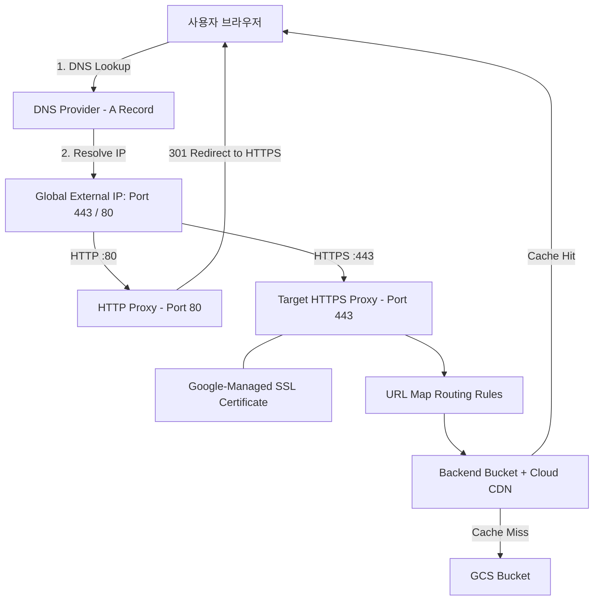

# GCP Storage Bucket & Custom Domain Hosting 

Google Cloud Storage (GCS) 정적 웹사이트를 Global HTTP(S) Load Balancer, Cloud CDN 및 Google-Managed SSL Certificate와 연결하여 대표 커스텀 도메인으로 서비스하는 **Single Domain & Multi-Path 정적 웹 호스팅 인프라** 코드 및 문서 집합입니다.

## 🔗 관련 링크 (Related Links)
- [Google Slide 발표 자료](https://docs.google.com/presentation/d/14vxTx2lSVIXocCX-GFBZ50fi11JGMbPWaU88wZGR_jE/edit?slide=id.g3a95e8cc196_8_56#slide=id.g3a95e8cc196_8_56)

---

## 🌟 주요 특징 (Key Features)

* **0초 반영 (Zero Downtime Extension):** 신규 문서/페이지 추가 시 Terraform 배포(인프라 변경) 없이 GCS 파일 업로드만으로 즉시 웹 반영
* **보안 & 성능:** Google-Managed SSL 자동 갱신, HTTP ➔ HTTPS 301 자동 리다이렉트, Cloud CDN 에지 캐싱 적용

---

## 🏗️ 아키텍처 및 트래픽 흐름 (Architecture & Traffic Flow)



### 트래픽 흐름 요약
1. **DNS 조회:** 클라이언트가 커스텀 도메인으로 접속하면 A 레코드를 통해 GCP Global External IP로 해소됩니다.
2. **HTTP -> HTTPS 리다이렉션:** HTTP(80 포트) 접속 시 Target HTTP Proxy가 301 Permanent Redirect 조치합니다.
3. **HTTPS 처리 & CDN 캐싱:** HTTPS(443 포트) 접속 시 Google-Managed SSL로 암호화 통신 후, Backend Bucket 및 Cloud CDN 에지 캐시에서 응답을 반환합니다. Cache Miss 시 GCS 버킷 내 객체를 조회합니다.

---

## 📂 프로젝트 디렉토리 구조

```text
gcs-custom-domain-hosting/
├── README.md                   # 프로젝트 사용 가이드 (본 문서)
│
├── providers.tf                # GCP Provider 및 Terraform 버전 정의
├── variables.tf                # Project ID, Domain Name, Region 등 변수 정의
├── storage.tf                  # GCS Bucket 생성, Website Config, 퍼블릭 IAM 및 자동 파일 업로드
├── lb.tf                       # Global IP, Managed SSL, Backend Bucket, URL Map, HTTPS Proxy
├── redirect.tf                 # HTTP(80) ➔ HTTPS(443) 301 리다이렉트 구성
├── outputs.tf                  # External Global IP 및 DNS 레코드 설정 안내 출력
│
├── terraform.tfvars            # 프로젝트 실제 설정값 (Git ignore 대상)
├── terraform.tfvars.example    # REPLACE-ME 플레이스홀더 포함 설정 템플릿
│
└── website_content/            # GCS 버킷에 배포될 HTML 콘텐츠 디렉토리
    ├── index.html              # REPLACE-ME-DOMAIN-NAME/ (메인 포털 대시보드)
    ├── 404.html                # 커스텀 404 에러 안내 페이지
    └── bq-ca-agent/
        └── index.html          # REPLACE-ME-DOMAIN-NAME/bq-ca-agent/ (BigQuery SQL Agent)
```

---

## 🚀 빠른 시작 가이드 (Quick Start Guide)

### 1. 설정값 입력 (`terraform.tfvars`)
`terraform.tfvars.example` 파일을 복사하여 `terraform.tfvars`를 작성하고, `REPLACE-ME` 부분에 본인의 GCP 환경 설정값을 입력합니다.

```bash
cp terraform.tfvars.example terraform.tfvars
```

Edit `terraform.tfvars`:
```hcl
project_id  = "REPLACE-ME-PROJECT-ID"
region      = "REPLACE-ME-REGION"
domain_name = "REPLACE-ME-DOMAIN-NAME"   # e.g. docs.yourdomain.com
bucket_name = "REPLACE-ME-BUCKET-NAME"   # e.g. public-docs-yourdomain-com
enable_cdn  = true
```

---

### 2. Terraform 인프라 배포 & 파일 자동 업로드
터미널에서 아래 명령어를 실행하면 GCP 인프라 생성과 동시에 `website_content/` 디렉터리의 HTML 파일들이 버킷으로 **자동 업로드**됩니다.

```bash
# 1) 초기화
terraform init

# 2) 변경 사항 검토
terraform plan

# 3) 인프라 생성 및 콘텐츠 자동 업로드 적용
terraform apply
```

*(참고: 로컬 `website_content/` 폴더의 HTML 파일을 수정하거나 새 폴더를 추가한 후 `terraform apply`를 실행하면 변경된 내용만 GCS로 자동 업데이트됩니다.)*

---

### 3. DNS A 레코드 등록
`terraform apply` 실행 결과로 출력된 `external_ip` (예: `REPLACE-ME-EXTERNAL-IP`) 주소를 DNS 관리 서비스에 **A 레코드**로 등록합니다.

| Record Type | Host / Name | Value (IP) |
| :--- | :--- | :--- |
| **A** | `REPLACE-ME-SUBDOMAIN` (e.g. `docs`) | `REPLACE-ME-EXTERNAL-IP` |

> 📌 **SSL 인증서 활성화 전파 시간:**
> DNS A 레코드 설정 후, Google-Managed SSL 인증서가 도메인 소유권을 확인하고 `ACTIVE` 상태가 되기까지 **약 15분 ~ 30분** 정도 소요될 수 있습니다.

---

## ➕ 신규 문서 / 에이전트 페이지 추가 방법

새로운 문서(예: `agent-xyz`)를 추가하고 싶은 경우, **인프라 재배포가 필요 없습니다.**

```bash
# 1. 로컬에 새 디렉토리 및 index.html 생성
mkdir -p website_content/agent-xyz
echo "<h1>Agent XYZ Document</h1>" > website_content/agent-xyz/index.html

# 2. GCS 버킷 해당 경로로 업로드 (또는 terraform apply 재실행)
gcloud storage cp -r website_content/agent-xyz gs://REPLACE-ME-BUCKET-NAME/

# 3. 브라우저에서 즉시 접속 확인 (대기시간 0초)
# https://REPLACE-ME-DOMAIN-NAME/agent-xyz/
```

---


