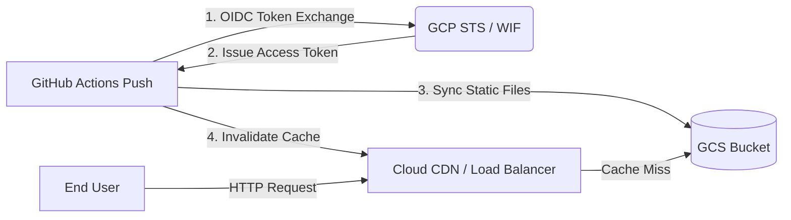

# GitHub to GCS & Cloud CDN Deployer with Workload Identity Federation

This project automates the deployment of a static website from GitHub to Google Cloud Storage (GCS) served behind a Global HTTP Load Balancer with Cloud CDN, authenticated securely using Workload Identity Federation (WIF).

---

## 🏗 Architecture Overview



### Components:
- **Workload Identity Federation (WIF)**: Enables GitHub Actions to authenticate to GCP without downloading or managing long-lived Service Account JSON keys.
- **Service Account (`github-deployer`)**: Bound to the WIF Pool Provider with restricted permissions (`roles/storage.objectAdmin`, `roles/compute.loadBalancerAdmin`).
- **GCS Bucket**: Stores static assets (`index.html`, `404.html`).
- **Global External HTTP Load Balancer & Cloud CDN**: Provides global edge caching, fast content delivery, and single IP entry point.

---

## 📁 Repository Structure

```text
networking/github-to-gcs-cdn-deployer/
├── main.tf           # Terraform resources (WIF, SA, GCS, CDN & Load Balancer)
├── variables.tf      # Variable definitions
├── terraform.tfvars  # Target GCP Project & Repository configuration
├── outputs.tf        # Output values (LB IP, WIF Provider ID, SA Email)
├── public/           # Static website source directory
│   ├── index.html
│   └── 404.html
├── README.md         # Documentation (Korean)
└── README-en.md      # Documentation (English)
```

---

## 🚀 Deployment Guide

### Step 1: Deploy GCP Infrastructure with Terraform

1. Navigate to the Terraform directory:
   ```bash
   cd networking/github-to-gcs-cdn-deployer
   ```

2. Review and configure `terraform.tfvars`:
   ```hcl
   project_id  = "YOUR_GCP_PROJECT_ID"
   github_repo = "YOUR_GITHUB_ORGANIZATION/YOUR_REPO_NAME"
   bucket_name = "YOUR_UNIQUE_BUCKET_NAME"
   region      = "asia-northeast3"
   ```

3. Initialize and apply Terraform:
   ```bash
   terraform init
   terraform apply
   ```

Note down the output values:
- `workload_identity_provider_name`
- `service_account_email`
- `load_balancer_ip`

---

### Step 2: Configure GitHub Actions Workflow

Create or update `.github/workflows/deploy-cdn.yml` in your repository root:

```yaml
name: GCS 및 Cloud CDN 정적 웹사이트 자동 배포

on:
  push:
    branches:
      - main
    paths:
      - 'networking/github-to-gcs-cdn-deployer/public/**'
  workflow_dispatch:

permissions:
  contents: read
  id-token: write # Required for Workload Identity Federation

jobs:
  deploy:
    name: GCS 업로드 및 Cloud CDN 캐시 무효화
    runs-on: ubuntu-latest
    steps:
      - name: 소스코드 체크아웃
        uses: actions/checkout@v4

      - name: Google Cloud 인증 (WIF)
        id: auth
        uses: google-github-actions/auth@v2
        with:
          workload_identity_provider: 'YOUR_WORKLOAD_IDENTITY_PROVIDER_NAME'
          service_account: 'YOUR_SERVICE_ACCOUNT_EMAIL'

      - name: GCS 버킷으로 정적 파일 업로드
        uses: google-github-actions/upload-cloud-storage@v2
        with:
          path: 'networking/github-to-gcs-cdn-deployer/public'
          destination: 'YOUR_GCS_BUCKET_NAME'
          parent: false

      - name: Cloud SDK 설정
        uses: google-github-actions/setup-gcloud@v2

      - name: Cloud CDN 캐시 전체 무효화
        run: |
          gcloud compute url-maps invalidate-cdn-cache website-url-map \
            --path="/*" \
            --async
```

---

### Step 3: Trigger Deployment

Push changes to the `main` branch:

```bash
git add .
git commit -m "feat: Deploy static website via WIF"
git push origin main
```

---

## 🔒 Security Best Practices

1. **Keyless Authentication**: No Service Account keys (`.json`) are stored or exposed.
2. **Strict Attribute Condition**: The WIF Provider includes an `attribute_condition` to restrict authentication strictly to tokens issued for your specific GitHub repository (`assertion.repository == "OWNER/REPO"`).
3. **Least Privilege IAM**: The dedicated Service Account only holds `roles/storage.objectAdmin` for the specific bucket and `roles/compute.loadBalancerAdmin` for CDN cache invalidation.
